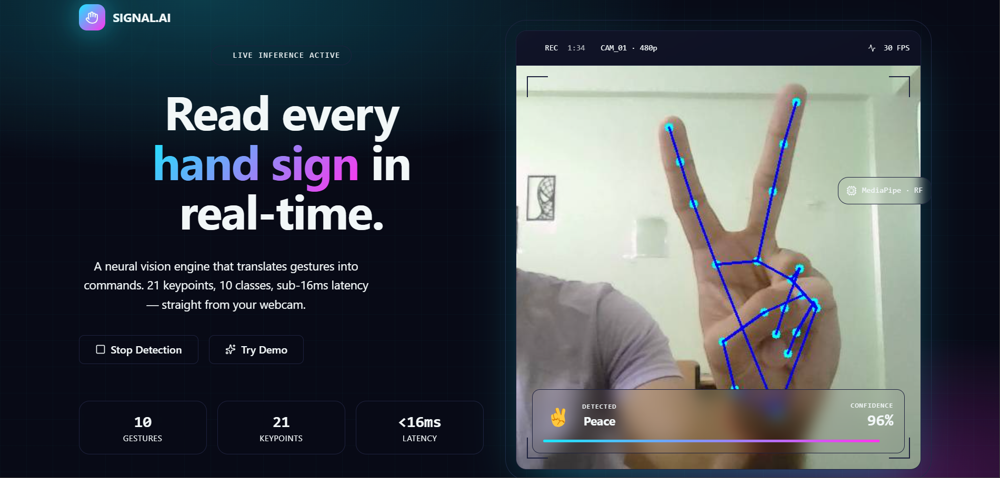
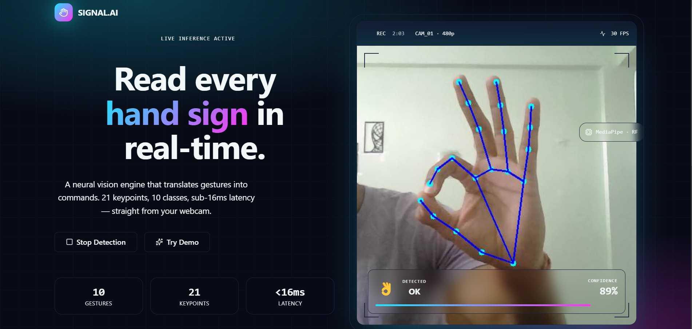
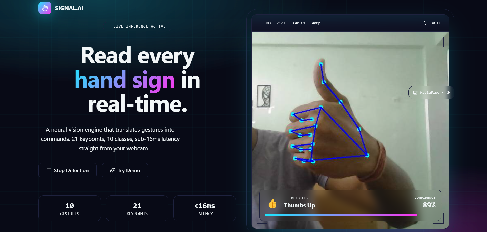
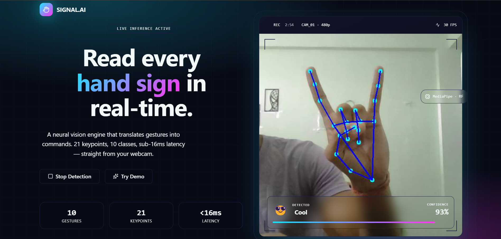
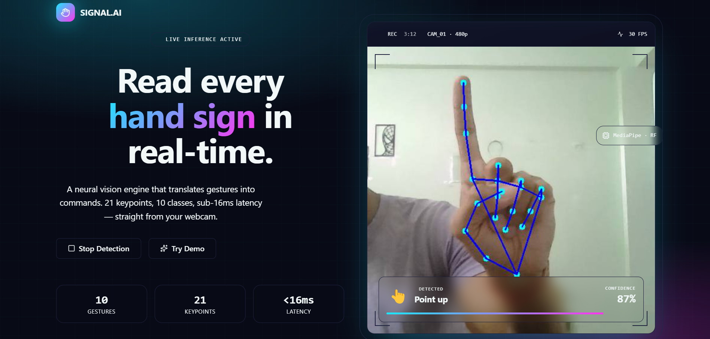
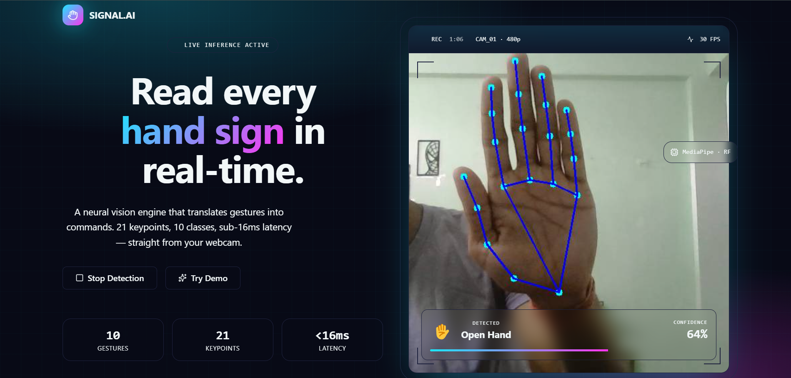

<div align="center">

# 🤚 GestureLens
### Real-Time Hand Gesture Detection Engine

<br/>


<br/>

> **21 keypoints · 10 gesture classes · ~30 FPS · runs entirely on your machine**

<br/>

</div>

---

## ✨ What is this?

**GestureLens** is a real-time hand gesture recognition system that translates your hand movements into classified gestures — live, from your webcam, with no data leaving your device.

It uses **Google's MediaPipe** to track 21 hand landmarks per frame, normalizes them relative to wrist position and hand scale, and feeds them into a trained **Random Forest classifier** that predicts your gesture in milliseconds. A **React frontend** receives the live annotated video stream and predictions over WebSocket.

---

## 🖐️ Supported Gestures

| # | Gesture | Label |
|---|---------|-------|
| 0 | ✊ | Closed Hand |
| 1 | ✋ | Open Hand |
| 2 | 👍 | Thumbs Up |
| 3 | ✌️ | Peace |
| 4 | 👆 | Point Up |
| 5 | 👌 | OK |
| 6 | 😎 | Cool |
| 7 | 👈 | Point Left |
| 8 | 👉 | Point Right |
| 9 | 👎 | Thumbs Down |

---

## 🏗️ Architecture

```
Webcam
  │
  ▼
MediaPipe HandLandmarker        ← 21 keypoints per hand
  │
  ▼
Feature Extraction              ← normalize by wrist + scale (42 features)
  │
  ▼
Random Forest Classifier        ← gesture_model.pkl
  │
  ▼
WebSocket Server (ws://localhost:8765)
  │
  ▼
React Frontend (localhost:5173) ← live annotated frames + predictions
```

---

## 📁 Project Structure

```bash
GestureLens/
│
├── backend/
│   ├── collect_data.py         # Collect gesture landmark data
│   ├── model.py                # Train Random Forest classifier
│   ├── server.py               # WebSocket backend server
│   ├── gesture_model.pkl       # Trained ML model (generated after training)
│   ├── gesture_data.csv        # Dataset containing collected samples
│   ├── hand_landmarker.task    # MediaPipe hand tracking model
│   └── requirements.txt
│
├── frontend/
│   ├── src/
│   │   ├── components/
│   │   ├── pages/
│   │   └── App.tsx
│   ├── package.json
│   └── vite.config.ts
│
└── README.md
```

---

## 🚀 Getting Started

### 1. Clone the Repository

```bash
git clone https://github.com/deepak-sh-07/GestureLens
cd GestureLens
```

---

## ⚙️ Backend Setup

### Install Python Dependencies

```bash
cd backend
pip install mediapipe opencv-python scikit-learn numpy websockets joblib pandas
```

### Download MediaPipe Model

Download `hand_landmarker.task` from [MediaPipe Models](https://developers.google.com/mediapipe/solutions/vision/hand_landmarker) and place it inside the `backend/` folder.

### Collect Gesture Data

```bash
python collect_data.py
```

> Press keys `0–9` to label the gesture you're showing. Collect **80–100 samples** per gesture for best accuracy.

### Train the Model

```bash
python model.py
```

> Generates `gesture_model.pkl`. Accuracy report prints to console.

### Start the Backend Server

```bash
python server.py
```

> WebSocket server starts on `ws://localhost:8765`

---

## 💻 Frontend Setup

Open a new terminal:

```bash
cd frontend
npm install
npm run dev
```

> Frontend runs on `http://localhost:5173` — click **Start Detection** to begin.

---

## 📸 Screenshots

<div align="center">










</div>

---

## 🔬 How the Model Works

Each hand frame produces **42 features** — the x and y coordinates of all 21 landmarks, normalized as:

```python
x = (landmark.x - wrist.x) / scale
y = (landmark.y - wrist.y) / scale
```

Where `scale` is the Euclidean distance between **wrist (point 0)** and **middle finger tip (point 12)**. This makes predictions invariant to hand size, position, and camera distance.

These 42 features are passed to a `RandomForestClassifier(n_estimators=100)` which outputs both a predicted class and confidence scores via `predict_proba`.

---

## 🎨 Tech Stack

| Layer | Technology |
|-------|------------|
| Hand Tracking | MediaPipe HandLandmarker |
| ML Classifier | scikit-learn RandomForest |
| Backend | Python · asyncio · websockets · OpenCV |
| Frontend | React · TypeScript · Tailwind CSS |
| Streaming | WebSocket (base64 JPEG frames + JSON) |

---

## 💡 Tips for Better Accuracy

- Collect samples in **varied lighting** conditions
- Show gestures at **different distances** from the camera
- Collect at least **80–100 samples** per gesture
- Avoid geometrically similar gestures — they confuse the classifier
- Always retrain after adding or removing gesture classes

---

## 🗺️ Roadmap

- [ ] Add more gesture classes
- [ ] Replace Random Forest with a lightweight neural network (MLP)
- [ ] Two-hand gesture support
- [ ] Map gestures to system actions (media control, shortcuts)
- [ ] Improve robustness across varied lighting and backgrounds
- [ ] Browser-native version (no local server required)

---

<div align="center">

Built with 🤚 by [Deepak](https://github.com/deepak-sh-07)

**MediaPipe · RandomForest · React · WebSocket**

</div>
